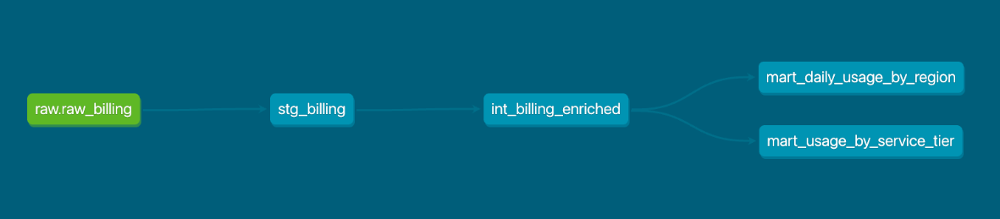

# upcloud-billing-duckdance

A small billing data pipeline built for the UpCloud Senior Data Engineer assignment. Reads Hive-partitioned CSVs from UpCloud Object Storage, transforms them with dbt, and produces aggregated marts. Documentation, trade-offs, and a discussion of what production would look like are in this README.

## Setup

The pipeline runs locally with Python 3.12 and uses DuckDB as the warehouse. No cloud accounts, containers, or external services are required.

Clone the repo: 
```
git clone https://github.com/Nil-VJ/upcloud-billing-duckdance.git
cd upcloud-billing-duckdance
```

Create and activate a virtual environment:
```
python3.12 -m venv .venv
source .venv/bin/activate
```

Install dependencies: 
```
pip install -r requirements.txt
```

The main dependencies are `duckdb`, `dbt-core`, and `dbt-duckdb`. Full versions are pinned in `requirements.txt`.

That is the whole setup. The pipeline reads from a public bucket so no credentials are needed, and the `warehouse.duckdb` file is created automatically on first run.

To verify the install before running the pipeline: 
```
dbt debug --project-dir dbt_project --profiles-dir dbt_project
```

This checks that the dbt project config, profile, and DuckDB connection are all working. All checks should pass.

## Architecture

The pipeline has four layers: storage, compute, transformation, and orchestration. Each layer was picked to keep the architecture light and the dependencies few. The assignment explicitly asks for this and I agree with it for a dataset of this size.

### Storage

Source data lives in UpCloud Object Storage as Hive-partitioned CSVs at `year=YYYY/month=MM/day=DD/billing.csv`. The bucket allows public HTTPS reads of specific files but rejects anonymous S3 LIST, so a glob like `year=*/month=*/day=*/billing.csv` does not work. I generate the list of partition URLs in Python and pass them to DuckDB explicitly. This is closer to how a real incremental pipeline behaves anyway, since you would not want to LIST the full bucket on every run.

Marts are materialized as tables inside the DuckDB file. A reviewer can open the file with the DuckDB CLI or any DuckDB-compatible tool and query the marts directly with SQL. In production these would land in BigQuery as tables, and the same dbt models would point at the BigQuery profile instead of the DuckDB profile.

### Compute: DuckDB

DuckDB reads CSVs directly from the bucket over HTTPS using the `httpfs` extension and runs SQL aggregations in-process. No server, no containers, no separate engine to manage. For a single-developer pipeline against a few hundred megabytes per partition, this is the right tool. It would not scale to terabytes, but in here it is not needed.

The honest trade-off: DuckDB is fast for analytical queries but is single-node. If the dataset grew enough that one machine could not hold the working set, I would move the compute to BigQuery or a Spark cluster. For this assignment, DuckDB is the right tool here.

### Transformation: dbt with the dbt-duckdb adapter

dbt structures the SQL transformations into staging, intermediate, and marts layers. Three reasons I chose this over plain SQL scripts:

1. Tests come for free. Schema tests like `not_null` and `unique` and custom data tests run with `dbt test`.
2. Lineage comes for free. `dbt docs generate` builds a model-level DAG you can browse.
3. The pattern matches what UpCloud already uses. The job description mentions dbt explicitly.

The dbt-duckdb adapter is the bridge. It is community-maintained, and lets dbt treat DuckDB as a warehouse.

### Orchestration: Python script now, Airflow DAG for production

For the 3-hour build, orchestration is a Python script with a `main()` entry point. It does: discover new partitions, load them into DuckDB, run dbt, log the result.

I did not run Airflow locally because the setup overhead is high and the assignment caps build time at 3 hours. Instead I included one example Airflow DAG file in `airflow/` that shows how this would be wrapped in production. In UpCloud's case that would run on Composer, the managed Airflow on GCP.

This split is deliberate. A Python script is honest about what the pipeline actually does at its core. The Airflow DAG is honest about what changes for production: scheduling, retries, alerting, dependencies between tasks.

### Why not the obvious alternatives

A few choices I considered and rejected, in case it comes up:

- **pandas instead of DuckDB.** Works for small data but slower and uses more memory. DuckDB also gives me SQL, which the rest of the pipeline (dbt) needs anyway.
- **Spark or Dask.** Massive overkill for this dataset. Heavy dependencies, slow startup, harder to reason about.
- **Cloud-managed ETL (Dataflow, etc.).** The assignment explicitly says to prefer open source over expensive cloud services.
- **Just SQL scripts, no dbt.** Possible, but I would lose tests, lineage, and documentation. dbt's overhead is small.

## Data model

The pipeline produces four dbt models in three layers.

**Staging.** One model, `stg_billing`. A view over `raw_billing` that does light cleanup: renames `timestamp` to `operation_at` (avoiding the SQL reserved word), derives `operation_date` from the timestamp, flips `credit_usage` from negative to positive and renames it `credit_used`, and pre-casts `success` to an integer column `is_success_int` so marts can compute success rates with `AVG`. One row per billed operation.

**Intermediate.** One model, `int_billing_enriched`. A view over `stg_billing` that drops the redundant `year`, `month`, and `day` columns (covered by `operation_date`) and acts as the stable contract between staging and marts. The layer is thin in this project because there is little business logic to add for the current marts. It exists so that future derived columns have a home that does not force every mart to change.

**Marts.** Two tables, materialized for fast reads.

`mart_daily_usage_by_region` has one row per `(operation_date, region, currency)` and reports total credits used, operation count, and success rate. The use case is regional capacity and revenue trends.

`mart_usage_by_service_tier` has one row per `(operation_date, service_tier, operation_type, currency)` and reports total credits, average credits per operation, and operation count. The use case is finance and unit economics by tier.

Both marts group by currency because the dataset contains three currencies (JPY, USD, EUR) in roughly equal proportions. Summing credits across currencies would produce a number that looks like a total but is not one. Per-currency aggregation is the only honest answer.

### Tests

Each model declares `not_null` tests on the columns that downstream models depend on. The full pipeline runs 16 tests and they all execute in under half a second against the current dataset. Composite uniqueness on mart grain columns is guaranteed by the `GROUP BY` and would otherwise require the `dbt_utils` package, which I deliberately did not pull in for a 3-hour build.

## Idempotency

Re-running the pipeline produces the same warehouse state as a single run. This is by design, not a side effect, because reviewers and operators will need to re-run after fixes.

Two mechanisms make this work.

**State table.** A `processed_partitions` table inside `warehouse.duckdb` records every partition that loaded successfully, with its date, source URL, load timestamp, and row count. On each run, the pipeline computes the candidate dates from `START_DATE` to today, reads the state table, and only loads partitions not already there. Skipped 404s are not recorded, so they get retried on every run until the file appears.

**Atomic per-partition load.** Loading one partition is a single transaction: delete any existing rows for that date, insert fresh rows from the CSV, then write the state row. If anything fails midway, the transaction rolls back and the partition stays unprocessed. A crash never leaves `raw_billing` in a half-loaded state.

The combination means you can run `python ingestion/run_pipeline.py` as often as you want. New partitions get added, missing ones get retried, and re-runs against a fully-loaded warehouse do nothing except trigger dbt.

dbt itself is idempotent for free, because every model is either a view (rebuilt on every run) or a table (dropped and recreated on every run).

## Running the pipeline

Clone the repo and create a virtual environment with Python 3.12. Install dependencies: 
```
pip install -r requirements.txt
```

Then run the pipeline from the repo root: 
```
python ingestion/run_pipeline.py
```

This loads any new partitions from the bucket into a local `warehouse.duckdb` file, then runs `dbt build` to construct the staging, intermediate, and marts layers and execute all tests. The full chain runs end to end in one command.

To inspect the output, open the DuckDB file from Python: 
```
python -c "import duckdb; con = duckdb.connect('warehouse.duckdb'); print(con.execute('select * from mart_daily_usage_by_region limit 10').fetchdf())"
```

Re-running the pipeline is safe. Partitions that have already been loaded are skipped, and dbt rebuilds the marts against whatever data is currently in `raw_billing`.

### A note on 404s

The bucket adds new partitions over time. The pipeline tries every date from `START_DATE` to today, and partitions that do not yet exist return HTTP 404. These show up in the log as `WARNING Skipped YYYY-MM-DD: HTTP 404` and are expected. The next run picks them up automatically once the file appears in the bucket.

## Data lineage and catalog

dbt generates both for free from the model files and YAML metadata.

`dbt docs generate` compiles every model, source, and test into a JSON manifest. `dbt docs serve` starts a local web server that turns the manifest into a browsable catalog. Each model has its description, column descriptions, declared tests, source code, and compiled SQL on one page.

The lineage graph shows the full DAG: `raw.raw_billing` (the source) flows into `stg_billing`, which flows into `int_billing_enriched`, which feeds both marts. Useful for two things in practice: explaining to a non-engineer where a number on a dashboard comes from, and troubleshooting when a test fails by walking back upstream until the bad input is found.



Generate and view the docs with:

```
dbt docs generate --project-dir dbt_project --profiles-dir dbt_project
dbt docs serve --project-dir dbt_project --profiles-dir dbt_project
```

## GDPR considerations

The dataset contains a `user_id` column, which is personal data under GDPR even though it is a number rather than a name. A pipeline that handles billing data needs to take it seriously.

### Data classification

Looking at the 14 columns:

- **Personal data:** `user_id`. Even though it is pseudonymous, it identifies an individual when combined with other systems. Under GDPR this still counts as personal data.
- **Possibly personal in context:** `resource_id` and `invoice_id`. On their own they identify resources or transactions, not people. Joined with `user_id`, they become traceable to individuals.
- **Not personal:** timestamp, credit_usage, region, service_tier, operation_type, success, resource_type, currency, year, month, day.

The practical implication for this pipeline: raw and staging tables contain user_id and are in scope for GDPR. The aggregated marts group by dimensions like region, service_tier, and day, and drop user_id entirely. Those marts are out of GDPR scope because no individual can be identified from a row like '(us-chi1, 2024-01-01, -88M total credits)'. This is a deliberate design choice: aggregation is itself a form of GDPR data minimization.

### Pseudonymization

`user_id` looks already pseudonymous in this dataset (it is an integer, not an email or name). For marts, I aggregate by dimensions that do not include `user_id` whenever the use case allows. Where per-user data is needed, the right pattern is to keep `user_id` only in restricted tables and grant access only to roles that need it.

### Retention and right to erasure

Two tensions worth naming.

**Retention.** Billing records and personal data want different lifespans. Billing records often need to be kept for years for audit and finance reasons. Personal data inside those records (the `user_id` column) should only be kept as long as the original purpose requires. The pipeline does not currently enforce retention rules. In production, a scheduled job would either delete or anonymize raw partitions older than the retention threshold, while keeping the aggregated marts intact.

**Right to erasure.** If a user requests deletion, the raw partitions can be filtered to remove their rows. Aggregated marts are harder because that user's data is mixed into sums and averages across millions of others. The pragmatic answer: keep the raw data around so the marts can be recomputed if needed. For aggregates over very large groups, the values are anonymous enough that erasure typically does not apply to them.

### Data residency

UpCloud's value proposition includes European data sovereignty. For this pipeline, that means: source data stays in UpCloud Object Storage (European regions), the pipeline runs in European regions, and outputs land in European regions. DuckDB running on a developer's laptop is fine for this assignment, but in production the compute would run on European infrastructure too. This is not just a GDPR checkbox; it is the product story.

## Time spent

Just over 3 hours of focused build time. Architecture and GDPR sections of this README were drafted beforehand as design notes; the rest was written during the build.
